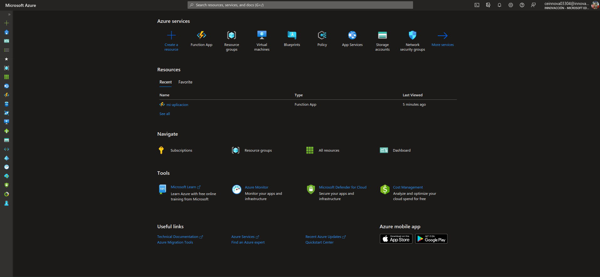
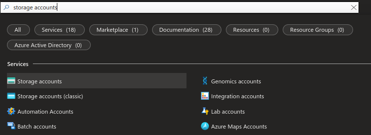
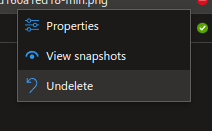
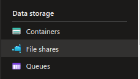

# Storing files in an Azure Storage Account

---------------------------------------------------------

## Requirements
- Microsoft Azure Account ( with funds or credits    )
- Microsoft Azure Suscription
- A web browser
- Access to internet

---------------------------------------------------------

## Create Storage Account
#### 1. Login to the [Azure Portal](https://portal.azure.com/).
#### 2. Once you're on the portal's home page, you will see something like this:

#### 3. Inside the search bar (located at the top), look for *storage accounts* and click on it.

#### 4. Click on *Create*.

#### 5. First, configure the *Basics* for your storage account: subscripton, resource group and name. If you want, you can change the redundancy option, but I suggest that you leave it as it is.

#### 6. Click on *Networking* and make sure *Enable public access from all networks* is selected.

#### 7. Click on *Review + create*.

#### 8. If validation passed, click *Create*.

#### 9. Deployment will begin, please wait a couple of seconds.

#### 10. Once deployment has been completed, click on *Go to resource*.

#### 11. You will now be inside a dashboard .

---------------------------------------------------------

## Blob Storage
#### 1. Go to your storage account's dashboard and click on *Containers*.

#### 2. Click on the *+ Container* button.

#### 3. Give your container a name and set the public access level to *Container* (this will make your blob available to anyone worldwide). When you're done, click *Create*.

#### 4. Click on your newly created container.
#### 5. Click *Upload*.

#### 6. Select some files to upload and, when you're done, click *Upload*.

#### 7. You have now uploaded your files to the blob. You are able to preview, download, share and edit them. For example, if you uploaded an image and you want to share it, you can go to the *Overview* tab, copy the URL and use it elsewhere.

#### 8. If you upload a web page (such as the one in this repository), you could also host a static web page in here (of course, you would also need to import CSS and JS files in order to improve the overall experience of your page).

#### 9. Now, let's say you remove a file from your blob. You can see which files have been deleted by clicking on the *Show deleted blobs* switch; you can also undelete them by right clicking the deleted file and clicking *Undelete*.

#### 10. By right-clicking a file and clicking *View snapshots*, you are able to manage snapshots of your file; snapshots are a read-only version of a blob that's taken at a point in time.

---------------------------------------------------------

## File Storage
#### 1. Go to your storage account's dashboard and click on *File shares*.

#### 2. Click on the *+ File Share* button.

#### 3. Give your new file share a name. I suggest you leave the tier as *Transaction optimized* in order to access your files instantly (if you want a cheaper but slower alternarive, you can change it). When you're done, click *Create*.

#### 4. Click on your newly created file share, you will now be inside its dashboard.

#### 5. To upload files in here, just click on *Upload*, choose your files and then click *Upload*.

#### 6. If you click on the *Connect* button, you can connect to your file share from your local system. You just need to copy the corresponding command to your OS terminal and you'll be able to connect to it.

---------------------------------------------------------

## Queue Storage
#### 1. Go to your storage account's dashboard and click on *Queues*.

#### 2. Click on the *+ Queue* button.

#### 3. Give you queue a name and click *Ok*.

#### 4. Click on your new queue to enter to its dashboard

#### 5. You can add messages to your queue by clicking *Add message*, writing it and then clicking *Ok*.

#### 6. You can delete messages from the queue and clear the whole queue as well.

---------------------------------------------------------

## Table Storage
#### 1. Go to your storage account's dashboard and click on *Tables*.

#### 2. Click on the *+ Table* button.

#### 4. Give your table a name and click *Ok*.

#### 5. In order to edit your table, you must use the *Storage browser*. Once you're in there, click on tables and then on the table you created.

#### 6. Click on *Add entity*.

#### 7. Insert properties and values to add. Once you're done, click *Insert*.

#### 8. You have now inserted a new item into your table.

---------------------------------------------------------

## Congratulations ! You've just worked with all of the available options in an Azure Storage Acoount !